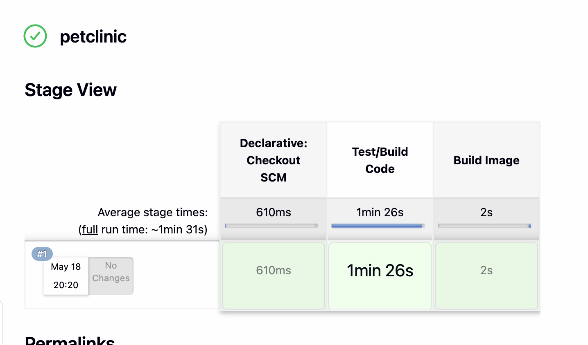

## Overview 
* This demo has a design goal to be fully automated so that a single command can be used to create the entire pipeline. Certain plugins were chosen to enable automated configuration such as `Configuration as Code` and `Jenkins DSL`
* Another design goal was to use a docker container to test and build the application. This unburdens developers who want to upgrade the underlying SDK to compile their software without requiring pipeline upgrades



## Additions to repo
* `Jenkinsfile` - configures pet clinic pipeline
* `jcenter-maven-settings.xml` - settings to point maven to jcenter repository
* `Dockerfile` - tells docker how to build the container
* `pipeline/` - directory containing setup scripts and README for building Jenkins pipeline


## Setup Jenkins
* Deploying jenkins requires launching via docker compose

```bash
cd pipeline/jenkins
docker compose up -d
```

## Run Petclinic Pipeline

* Login via http://localhost:8080
    * Username: admin
    * Password: admin
* Navigate to http://localhost:8080/job/petclinic/ and click "Build Now"

## Stages
* `Test/Build Code` - runs a single command to test and package the application
* `Build Image` - builds the docker image
 
## Jenkins Plugins Used

| Plugin | Description |
| ------ | ----------- |
| Git | enables pulling from git repo | 
| Docker Pipeline | running pipeline inside docker containers |
| Pipeline | running pipelines via Jenkinsfile |
| Pipeline State View | visually see stages |
| Jenkins DSL | Create pipeline jobs from DSL code |
| Configuration as Code | Automate setup of jenkins via jenkins.yml config |

## Considerations
* While ideally jenkins should not be run as `root`, it was required on Mac with Docker Desktop to access the `/var/run/docker.sock` file. In an ideal production configuration, a non privileged user would be used to run jenkins and the correct permissions would be set for docker.sock
* The end of this pipeline should push the container to an artifact repo (ideally artifactory) but the artifactory CE version does not allow docker repositories
* This build could have used a local artifactory to act as a maven proxy to download images, but there challenges in automating a fully configured artifactory. Using an internally hosted artifactory would enable organizations to control which dependencies are allowed by development teams
* This pipeline could also leverage caching to speed up the download of dependencies